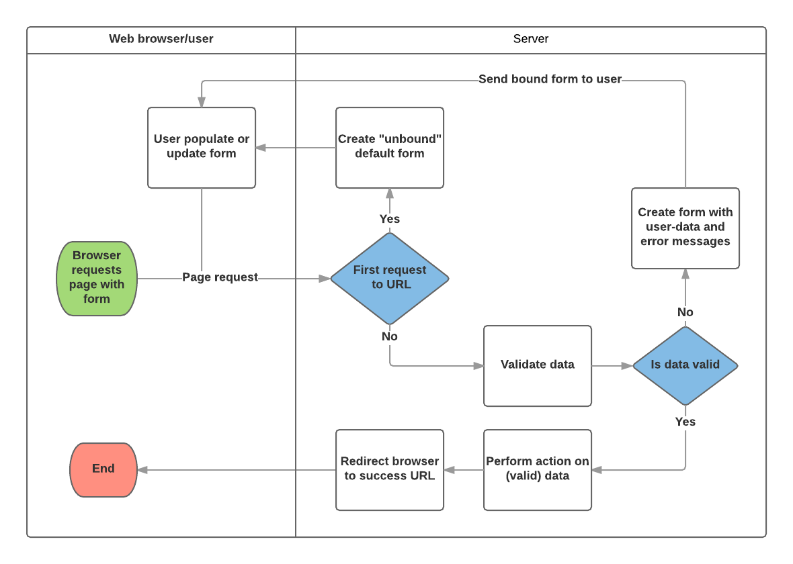

# Reading

## Django Forms

- how to work with HTML Forms in Django, and, in particular, the easiest way to write forms to create, update, and delete model instances.

- Forms are also a relatively secure way of sharing data with the server, as they allow us to send data in POST requests with cross-site request forgery protection.

- Developers need to write HTML for the form, validate and properly sanitize entered data on the server (and possibly also in the browser), repost the form with error messages to inform users of any invalid fields, handle the data when it has successfully been submitted, and finally respond to the user in some way to indicate success

- The form is defined in HTML as a collection of elements inside <form>...</form> tags, containing at least one input element of type="submit

``` python
<form action="/team_name_url/" method="post">
    <label for="team_name">Enter name: </label>
    <input id="team_name" type="text" name="name_field" value="Default name for team.">
    <input type="submit" value="OK">
</form>
```

- The field's type attribute defines what sort of widget will be displayed
- The name and id of the field are used to identify the field in JavaScript/CSS/HTML
- value defines the initial value for the field when it is first displayed
- matching team label is specified using the label tag, with a for field containing the id value of the associated input.
- action: The resource/URL where data is to be sent for processing when the form is submitted. If this is not set (or set to an empty string), then the form will be submitted back to the current page URL.
- method: The HTTP method used to send the data: post or get
- POST method should always be used if the data is going to result in a change to the server's database because this can be made more resistant to cross-site forgery request attacks.
- GET method should only be used for forms that don't change user data (e.g. a search form). It is recommended for when you want to be able to bookmark or share the URL.



The Steps this chart take:

1. Display the default form the first time it is requested by the user
2. Receive data from a submit request and bind it to the form.
3. Clean and validate the data.
4. If any data is invalid, re-display the form, this time with any user populated values and error messages for the problem fields
5. If all data is valid, perform required actions (e.g. save the data, send an email, return the result of a search, upload a file, etc.)
6. Once all actions are complete, redirect the user to another page.

> Form data is stored in an application's forms.py file, inside the application directory. Create and open the file locallibrary/catalog/forms.py.

``` python
from django import forms

class RenewBookForm(forms.Form):
    renewal_date = forms.DateField(help_text="Enter a date between now and 4 weeks (default 3).")
```

- Django provides numerous places where you can validate your data. The easiest way to validate a single field is to override the method clean_<fieldname>() for the field you want to check. So for example, we can validate that entered renewal_date values are between now and 4 weeks by implementing clean_renewal_date() as shown below.

Update your forms.py file so it looks like this:

``` python
import datetime

from django import forms
from django.core.exceptions import ValidationError
from django.utils.translation import ugettext_lazy as _

class RenewBookForm(forms.Form):
    renewal_date = forms.DateField(help_text="Enter a date between now and 4 weeks (default 3).")

    def clean_renewal_date(self):
        data = self.cleaned_data['renewal_date']

        # Check if a date is not in the past.
        if data < datetime.date.today():
            raise ValidationError(_('Invalid date - renewal in past'))

        # Check if a date is in the allowed range (+4 weeks from today).
        if data > datetime.date.today() + datetime.timedelta(weeks=4):
            raise ValidationError(_('Invalid date - renewal more than 4 weeks ahead'))

        # Remember to always return the cleaned data.
        return data
```

- add a URL configuration
- bottom of locallibrary/catalog/urls.py

``` python
urlpatterns += [
    path('book/<uuid:pk>/renew/', views.renew_book_librarian, name='renew-book-librarian'),
]
```

- For forms that use a POST request to submit information to the server, the most common pattern is for the view to test against the POST request type (if request.method == 'POST':) to identify form validation requests and GET (using an else condition) to identify the initial form creation request. If you want to submit your data using a GET request, then a typical approach for identifying whether this is the first or subsequent view invocation is to read the form data (e.g. to read a hidden value in the form).

``` python
import datetime

from django.shortcuts import render, get_object_or_404
from django.http import HttpResponseRedirect
from django.urls import reverse

from catalog.forms import RenewBookForm

def renew_book_librarian(request, pk):
    book_instance = get_object_or_404(BookInstance, pk=pk)

    # If this is a POST request then process the Form data
    if request.method == 'POST':

        # Create a form instance and populate it with data from the request (binding):
        form = RenewBookForm(request.POST)

        # Check if the form is valid:
        if form.is_valid():
            # process the data in form.cleaned_data as required (here we just write it to the model due_back field)
            book_instance.due_back = form.cleaned_data['renewal_date']
            book_instance.save()

            # redirect to a new URL:
            return HttpResponseRedirect(reverse('all-borrowed') )

    # If this is a GET (or any other method) create the default form.
    else:
        proposed_renewal_date = datetime.date.today() + datetime.timedelta(weeks=3)
        form = RenewBookForm(initial={'renewal_date': proposed_renewal_date})

    context = {
        'form': form,
        'book_instance': book_instance,
    }

    return render(request, 'catalog/book_renew_librarian.html', context)
```

- get_object_or_404(): Returns a specified object from a model based on its primary key value, and raises an Http404 exception (not found) if the record does not exist.
- HttpResponseRedirect: This creates a redirect to a specified URL (HTTP status code 302).
- reverse(): This generates a URL from a URL configuration name and a set of arguments. It is the Python equivalent of the url tag that we've been using in our templates.
- datetime: A Python library for manipulating dates and times.

> While you can also access the form data directly through the request (for example, request.POST['renewal_date'] or request.GET['renewal_date'] if using a GET request), this is NOT recommended. The cleaned data is sanitized, validated, and converted into Python-friendly types.

- Using {{ form.as_table }} as shown above, each field is rendered as a table row. You can also render each field as a list item (using {{ form.as_ul }} ) or as a paragraph (using {{ form.as_p }}).

- So, for example, we can access a number of separate items for our renewal_date field:

[x] {{ form.renewal_date }}: The whole field.
[x] {{ form.renewal_date.errors }}: The list of errors.
[x] {{ form.renewal_date.id_for_label }}: The id of the label.
[x] {{ form.renewal_date.help_text }}: The field help text.

- This is similar to our previous forms and renders the fields using a table. Note also how again we declare the  to ensure that our forms are resistant to CSRF attacks.

``` python



  <form action="" method="post">
    
    <table>
    {{ form.as_table }}
    </table>
    <input type="submit" value="Submit">
  </form>

```

- The "delete" view expects to find a template named with the format model_name_confirm_delete.html (again, you can change the suffix using template_name_suffix in your view). 

``` python




<h1>Delete Author</h1>

<p>Are you sure you want to delete the author: {{ author }}?</p>

<form action="" method="POST">
  
  <input type="submit" value="Yes, delete.">
</form>


```


### Bookmark/Skim

[x] [Review/Skim: Django Templates](https://developer.mozilla.org/en-US/docs/Learn/Server-side/Django/Home_page)
[x] [Review/Skim: Django Views](https://developer.mozilla.org/en-US/docs/Learn/Server-side/Django/Generic_views)